## Popular Web Languages
### The trend in last 5 years - What big data can tell us?

https://trends.google.com/trends/explore?date=today%205-y&q=%2Fm%2F060kv,%2Fm%2F05z1_,%2Fm%2F07sbkfb,%2Fm%2F02p97,%2Fm%2F015tjh
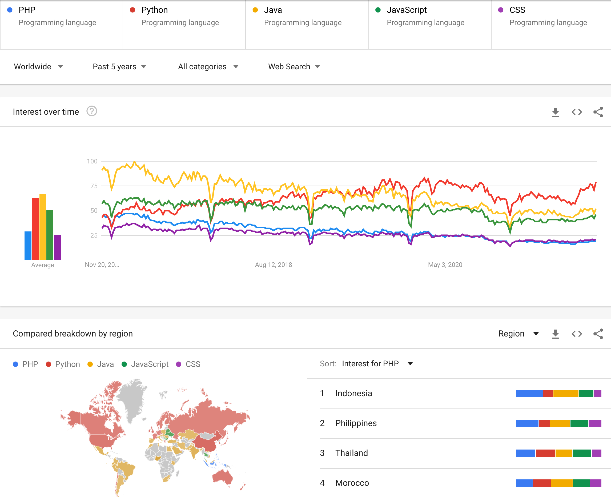

* World wide, Python is trending up while others are trending down. Why?
* Python is now dominant in most regions and programming domains.
* Only a few countries still have PHP as primary web Language.
* Which ones are front browser side languages? which ones are the back server side languages?
* What do PHP and CSS stand for?
* Why there are big dips around Christmas to New Year period?

https://trends.google.com/trends/explore?date=today%205-y&geo=CN&q=%2Fm%2F060kv,%2Fm%2F05z1_,%2Fm%2F07sbkfb,%2Fm%2F02p97,%2Fm%2F015tjh
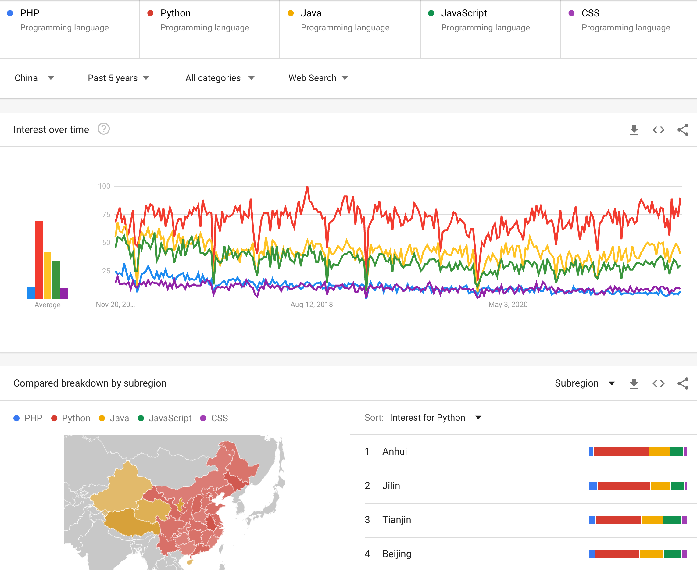

* In China, Python is dominant except a few places in the west.
* There are big dips around Chinese New Year period.

https://trends.google.com/trends/explore?date=today%205-y&q=HTTP,HTTPS,HTML,CSS,JavaScript
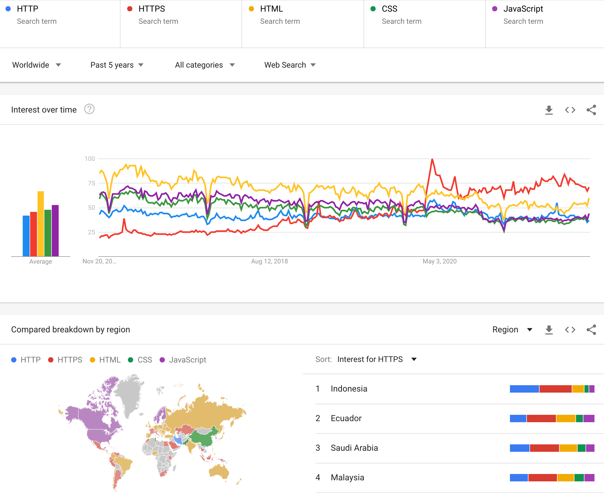

* What do HTTP, HTTPS and HTML stand for?
* World wide, HTTPS spiked up around Feb 2020. Why?
* HTTPS is the dominant world wide.
  
https://trends.google.com/trends/explore?date=today%205-y&geo=CN&q=HTTP,HTTPS,HTML,CSS,JavaScript
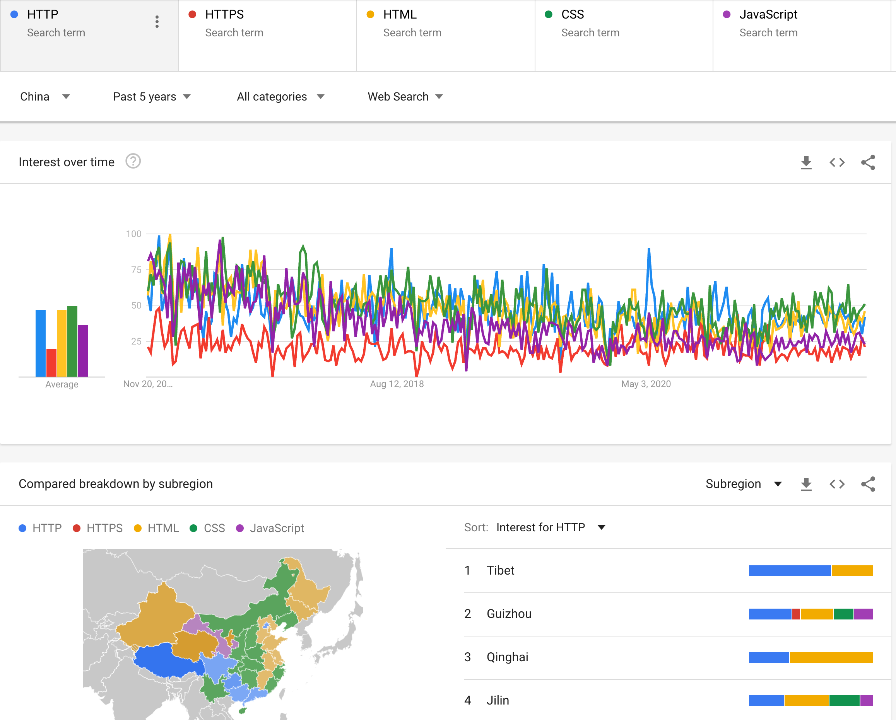

* In China HTTP is way more popular than HTTPS. Why?
* There is no spike-up of HTTPS around Feb 2020 in China, a big contrast to world wide. Why?

### Language Popularity in China

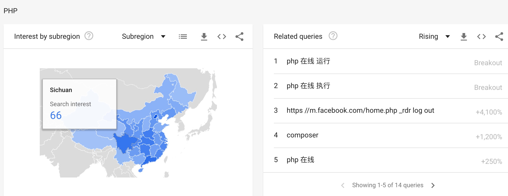
* Beijing = 100, Why?
  
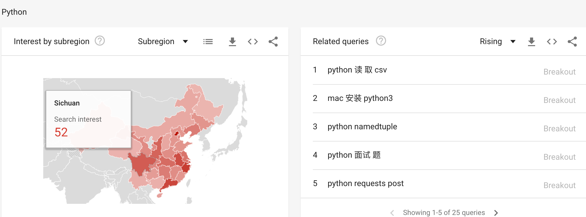
* Beijing = 100, Why?

* Zhejiang = 100, Why?

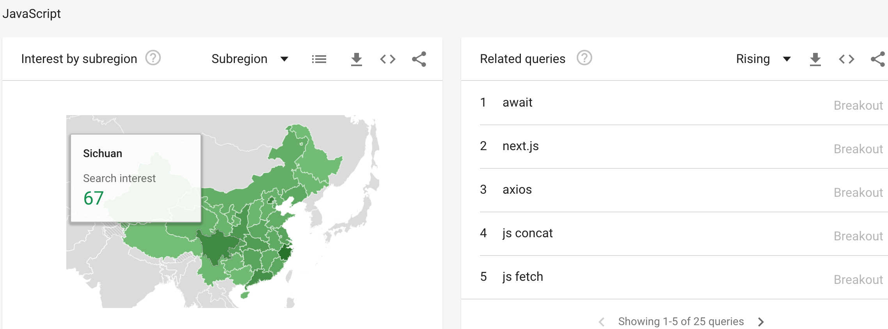
* Zhejiang = 100, Why?

* Zhejiang = 100, Why?
  
### Language Popularity World Wide

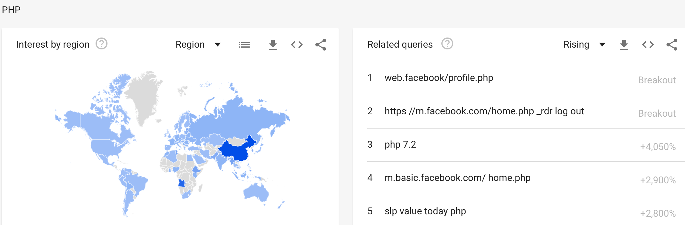
* China = 100, Why?
* India = 14
* US = 7
  
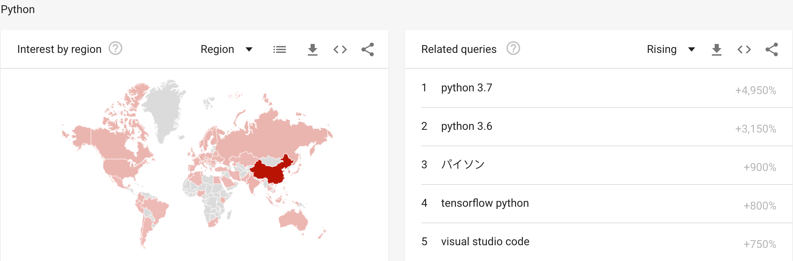
* China = 100, Why?
* India = 5
* US = 4

* China = 100, Why?
* India = 14
* US = 5

## Web Concepts

### Web 1.0 Static Web => Web 2.0 dynamic Web 

* Pure Static:
* 

* Pure Static + style formatting
* 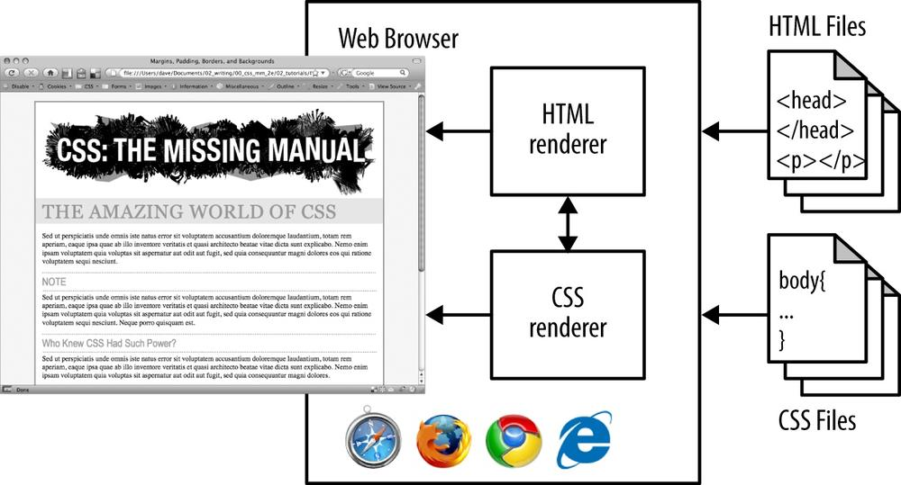

* Pure Static + style formatting + dynamic
* 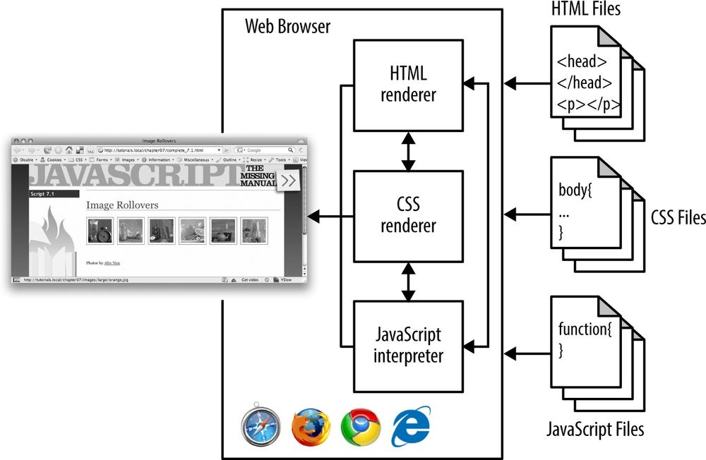

* HTML + CSS + JavaScript are all browser front side technology.
* Do you need a backend server to make them work?

### Client Side + Server Side = Web Applications

* How a PHP web site works?

* https://www.oreilly.com/library/view/php-mysql/9781449355517/ch01.html

* How a Python web site works?
* 
* https://dev.to/dev0928/how-to-deploy-python-flask-web-applications-4mh7
* https://flask.palletsprojects.com/en/1.1.x/deploying/

#### What are in common between PHP and Python web sites?

## LAMP Stack

### What is LAMP?
* L = Linux ( 99+% of servers are Linux)
* A = Apache Web Server 
* M = MySQL 
* P = PHP / Perl / Python
What are they all in common?
* They are all open source.

### LAMP Architecture
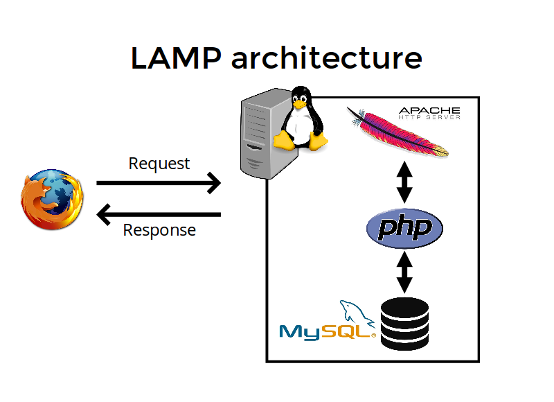
### What are the popular web servers?
* Nginx
* Apache Web Server
* IIS (Microsoft Internet Information Server)
  
https://trends.google.com/trends/explore?date=today%205-y&q=%2Fm%2F02qft91,%2Fm%2F0_h2,%2Fm%2F02l0s7r
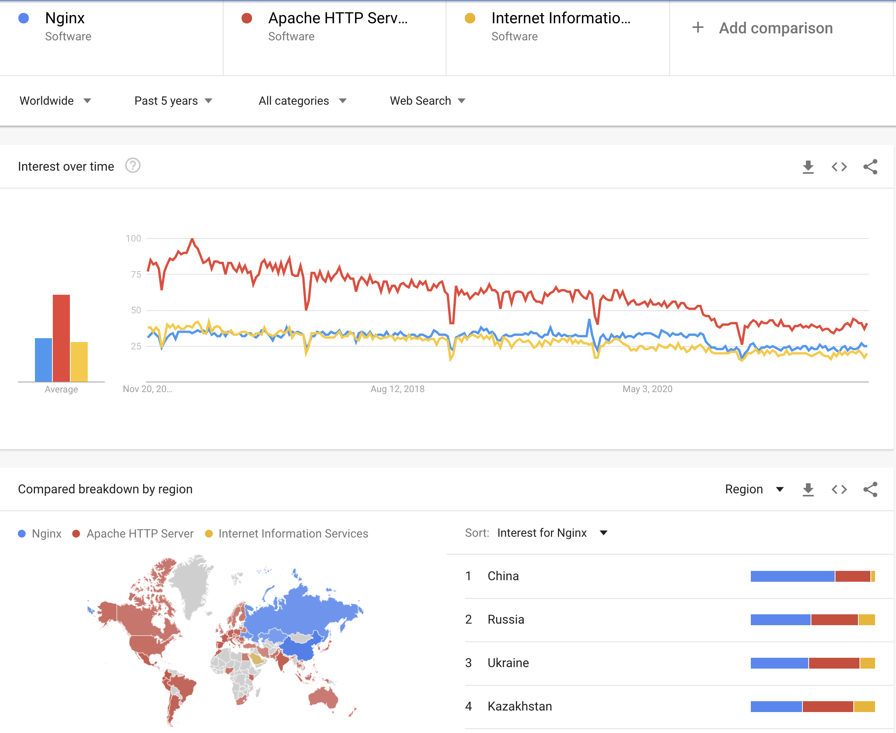
* In China, Nginx:Apache:IIS = 68:29:3
* In US, Nginx:Apache:IIS = 22:51:27
* Worldwide, Nginx:Apache:IIS = 25:41:20
* Nginx is lightweight and fast.
* China is leading the world in using Nginx
### What are the popular databases?
* MySQL.
* Oracle.
* PostgreSQL.
* Microsoft SQL Server.
* SQLite.
* MongoDB.

https://trends.google.com/trends/explore?date=today%205-y&q=%2Fm%2F04y3k,PostgreSQL,%2Fm%2F0120vr,%2Fm%2F01kgq9,MongoDB
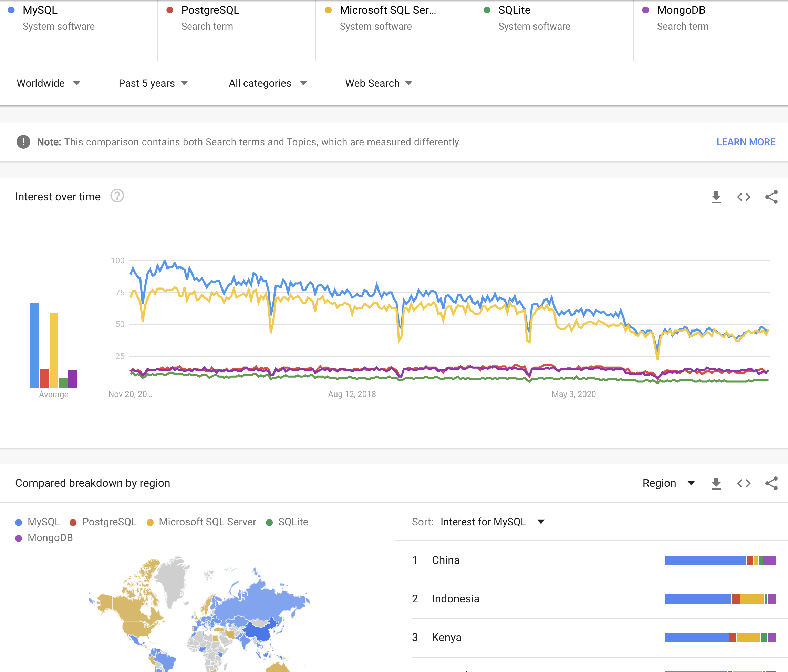
* MySQL is most popular worldwide, especially in China. Why?
* What is the main difference between MySQL and MS SQL Server?
* What is the main difference between MySQL and MongoDB? 
* What is relational DB vs Object DB?
  The difference between relational database and object oriented database is that the relational data base stores data in the form of tables which contains rows and columns. Every column in the table has its specific name and every row of the table has its own primary key. While in the object oriented database the data is stored in the form of objects. In the object oriented data the data is stored along with its actions that processes or reads the existing data.
* What is SQL vs NoSQL?
  
## Programming Tools
[Refer to Tools.md](Tools.md)

## A Dynamic Website Demo

### Technologies Involved

### How is it developed

### How is it deployed

