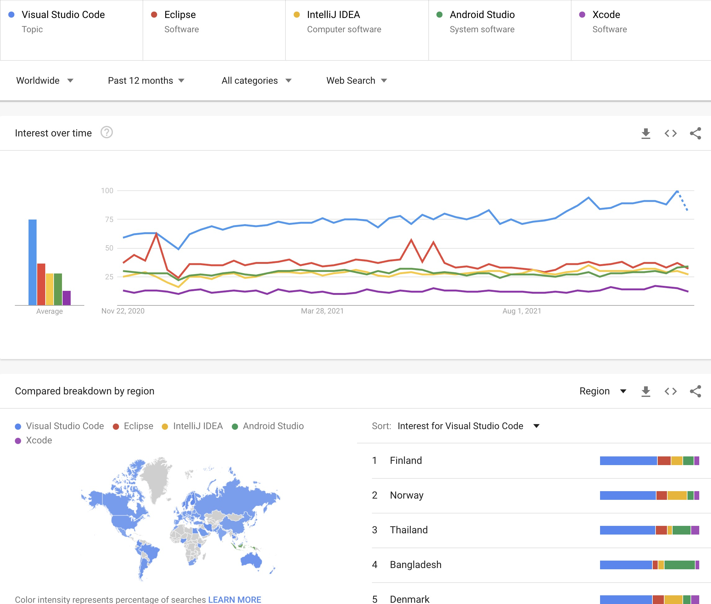
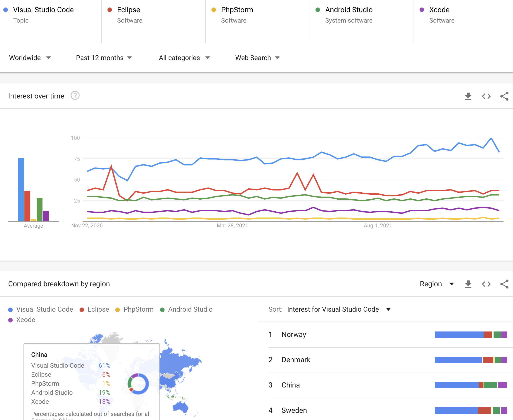
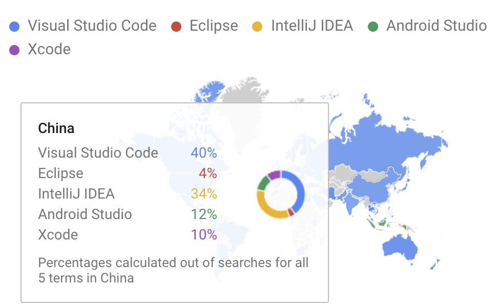
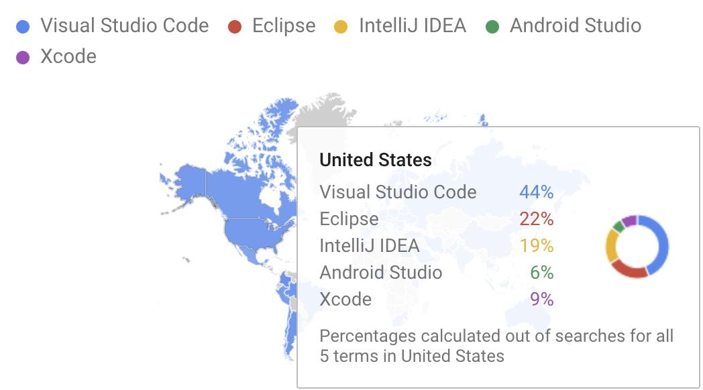
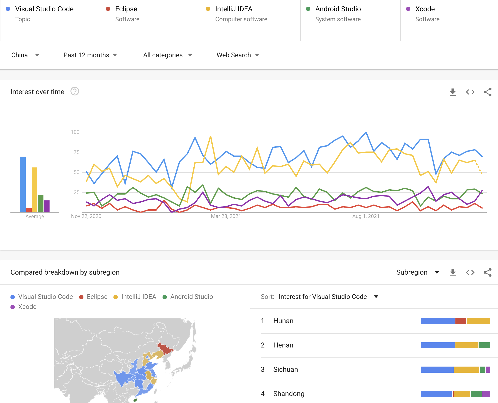
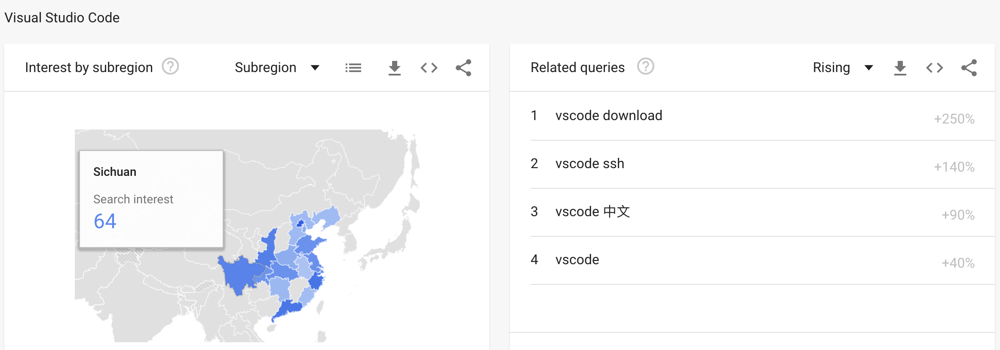
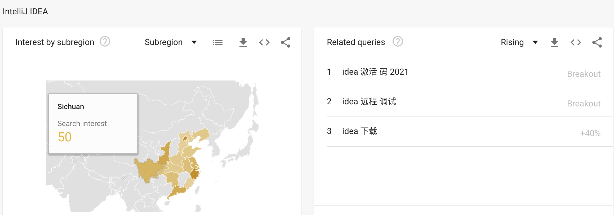
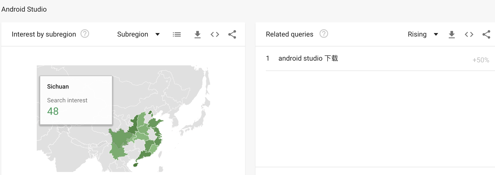
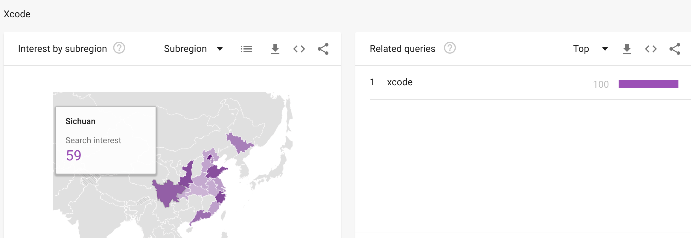

# Programming Tools

## VS Code (Visual Studio Code)

It is the best universal editor / IDE for almost every language and scripting you might need in computing.
https://code.visualstudio.com/

Major IDEs World Distributions:
https://trends.google.com/trends/explore?q=%2Fm%2F0134xwrk,%2Fm%2F01fs1d,%2Fm%2F03v0mn,%2Fm%2F0vpp538,%2Fm%2F01z_14

 

* What does IDE stands for?
* What are those IDEs good for? 
* Only VS Code trends up

China            |  US
:-------------------------:|:-------------------------:
  | 

Major IDEs China Distributions:
https://trends.google.com/trends/explore?geo=CN&q=%2Fm%2F0134xwrk,%2Fm%2F01fs1d,%2Fm%2F03v0mn,%2Fm%2F0vpp538,%2Fm%2F01z_14

* Beijing = 100

* Zhejing = 100, Why?

* Beijing = 100

* Beijing = 100

### VS Code and PHP

小白必看的php入门教程，php编辑神器推荐 - visual studio code（vscode），教大家装插件后提高效率:
* https://www.bilibili.com/video/BV1XE41147Kc?share_source=copy_web

### VS Code References

* https://www.bilibili.com/video/BV1XE41147Kc?share_source=copy_web
  
* VSCode 入门教程 https://geek-docs.com/vscode/vscode-tutorials/introduction-to-vscode.html

* VS Code 入门 https://www.bilibili.com/video/BV1LA411h7Yc/

* VSCode 新手快速入门指南 https://www.bilibili.com/video/BV1Ct411M7or/

## GitHub
